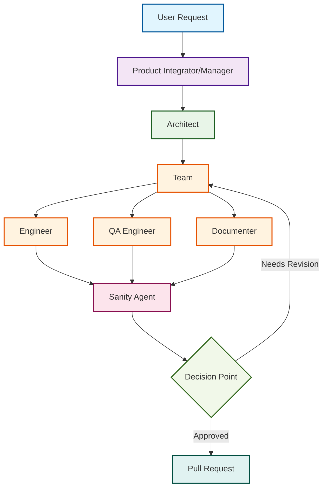

# AI Agent Workflow Diagram

This Mermaid diagram describes the flow from request to completion in the AI agent workflow system.

## Workflow Description

1. **Request**: Your initial feature request, bug report, or product idea
2. **Product Integrator/Manager**: Analyzes request, creates acceptance criteria and new issue artifacts
3. **Architect**: Designs technical approach, identifies dependencies, and creates development tasks
4. **Team**: Three parallel work streams:
   - **Engineer**: Implements code changes and ensures tests pass
   - **QA Engineer**: Creates and runs tests, validates functionality
   - **Documenter**: Updates documentation and creates user guides
5. **Sanity Agent**: Performs final validation and manual testing
6. **Decision Point**: Determines if work needs revision or is ready for production, if you work is not ready for a pull request at this step consider evaluating if there are any steps that can increase the accuracy of the artifacts produced by your code
7. **Pull Request**: Final output ready for review and deployment

## Key Features

- **Parallel Processing**: Engineer, QA Engineer, and Documenter work simultaneously
- **Quality Gates**: Sanity Agent provides final validation
- **Iterative Process**: Work can be sent back to the team for revisions
- **Clear Handoffs**: Each role has defined inputs and outputs that are actual artifacts, not temporal data
